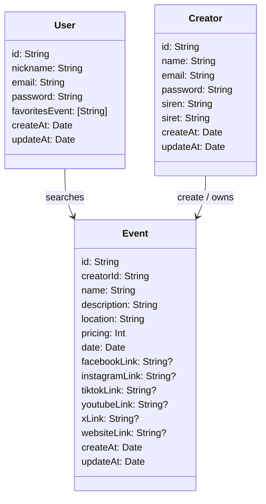

# IAKOA - Technical Documentation

## User Stories and Mockup

### User Stories Table

| User Role     | User Story Description                                                                                                                          | Priority    |
| :-----------: | ----------------------------------------------------------------------------------------------------------------------------------------------- | :---------: |
| $$\text{\color{red}{Must Have}}$$:      |                                                       |  |
| Normal User   | As a normal user, I want to search and find events around me or in a specific city/village, so I can explore activities in my desired location | Must Have   |
| Normal User   | As a normal user, I want the app to detect my location automatically, so I can see nearby events without manual input                          | Must Have   |
| Normal User   | As a normal user, I want to filter events by category, so I can find relevant events easily                                                    | Must Have   |
| Normal User   | As a normal user, I want to see a list of events near my current location, so I can browse them quickly                                        | Must Have   |
| Normal User   | As a normal user, I want to view detailed event information, so I can decide whether to attend                                                 | Must Have   |
| Event Creator | As an event creator, I want to create, edit, and manage my events, so I can keep information accurate                                          | Must Have   |
| Normal User   | As a user, I want to create an account, so I can save favorites and receive notifications                                                      | Must Have   |
| Normal User   | As a user, I want to add events to favorites, so I can access them easily later                                                                | Must Have   |
| Normal User   | As a user, I want to receive notifications for favorite events, so I stay updated                                                              | Must Have   |
| Normal User   | As a user, I want to manage my profile information and preferences, so I can customize my experience                                           | Must Have   |
| Normal User   | As a user, I want an iPhone-optimized app, so I can have a seamless experience                                                                 | Must Have   |
| Normal User   | As a user, I want a simple, intuitive interface, so I can navigate easily                                                                      | Must Have   |
| Normal User | As a user, I want to delete my account permanently, so I can remove all my personal data from the app | Must Have |
| Event Creator | As an event creator, I want to manage and delete my events, so I can keep my event list up-to-date and accurate | Must Have |
| Developer     | As a developer, I want to use Firebase for backend management, so I can build efficiently                                                      | Must Have   |
| QA Tester     | As a QA tester, I want thorough testing, so the app is bug-free                                                                                | Must Have   |
| Visitor       | As a visitor, I want a landing page explaining app features, so I understand its purpose                                                       | Must Have   |
| Event Creator | As a creator, I want SIREN/SIRET verification, so users trust my events                                                                        | Must Have |
| $$\text{\color{orange}{Should Have}}$$:     |                                                       |  |
| Normal User   | As a user, I want to search events by city name when not nearby, so I can plan ahead                                                           | Should Have |
| Normal User   | As a user, I want personalized notifications, so I receive relevant alerts                                                                     | Should Have |
| Normal User   | As a user, I want dark/light mode, so I can view comfortably at any time                                                                       | Should Have |
| Normal User   | As a user, I want to share events on social media, so I can invite friends                                                                     | Should Have |
| $$\text{\color{yellow}{Could Have}}$$:      |                                                       |  |
| Event Creator | As a creator, I want event performance analytics, so I can improve future events                                                               | Could Have  |
| Normal User   | As a user, I want a calendar view of events, so I can plan more effectively                                                                    | Could Have  |
| Normal User   | As a user, I want to message event organizers, so I can ask questions or get more info                                                         | Could Have  |
| Normal User   | As a user, I want to see trending events, so I don’t miss popular activities                                                                   | Could Have  |
| Normal User   | As a normal user, I want to see events on a map, so I can visualize their locations easily                                                     | Could Have  |
| $$\text{\color{gray}{Won't Have}}$$:     |                                                       |  |
| Normal User   | Ticket purchasing will not be available in-app                                                                                                 | Won't Have  |
| Normal User   | As a user, I want event recommendations based on preferences, so I can discover relevant events                                                | Won't Have |
| Normal User   | Social media login/integration will not be available                                                                                           | Won't Have  |
| Normal User   | Multi language support only                                                                                                                   | Won’t Have  |
| Normal User   | User reviews will not be available in this version                                                                                             | Won’t Have  |
| Normal User   | Advanced search filters will not be available                                                                                                  | Won’t Have  |
| Normal User   | Event reminders will not be available                                                                                                          | Won’t Have  |
| Normal User   | Personalized recommendations will not be available                                                                                             | Won’t Have  |
| Normal User   | Live streaming will not be available                                                                                                           | Won’t Have  |

## First UI Design :

## Design System Architecture

---
### 👤 Detailed User Class

#### Attributes
| Name           | Type      | Description                            | Constraints                                    |
| -------------- | --------- | -------------------------------------- | ---------------------------------------------- |
| id             | String    | Unique identifier of the user          | Required, Unique                               |
| nickname       | String    | User's nickname                        | Required                                       |
| email          | String    | User's email address                   | Required, Unique, Must be a valid email format |
| password       | String    | User's password                        | Required, Must be encrypted                    |
| favoritesEvent | \[String] | List of favorite event identifiers     | Can be empty                                   |
| createAt       | Date      | Date the user account was created      | Required, Automatically generated              |
| updateAt       | Date      | Date the user account was last updated | Required, Automatically generated              |

#### Methods
| Name                | Parameters                                                    | Description                                        | Return Type |
| ------------------- | ------------------------------------------------------------- | -------------------------------------------------- | ----------- |
| createUser          | nickname: String, email: String, password: String             | Creates a new user                                 | Void        |
| updateUser          | id: String, nickname: String, email: String, password: String | Updates an existing user's information             | Void        |
| deleteUser          | id: String                                                    | Deletes a user                                     | Void        |
| addFavoriteEvent    | userId: String, eventId: String                               | Adds an event to the user's list of favorites      | Void        |
| removeFavoriteEvent | userId: String, eventId: String                               | Removes an event from the user's list of favorites | Void        |
---
#### Relations
| Related Class | Relationship Type  | Description                                                              |
| ------------- | ------------------ | ------------------------------------------------------------------------ |
| Event         | Association (1\:N) | A user can search for and add multiple events to their list of favorites |

---

### ✍️ Detailed Creator Class
##### Class: Creator

| Attribute   | Type   | Description                      | Constraints                          |
|-------------|--------|----------------------------------|--------------------------------------|
| id          | String | Unique identifier of the creator | Required, Unique                     |
| name        | String | Name of the creator              | Required                             |
| email       | String | Email address of the creator     | Required, Unique, Valid email format |
| password    | String | Creator's password               | Required, Encrypted                  |
| siren       | String | SIREN number                     | Required, Valid format               |
| siret       | String | SIRET number                     | Required, Valid format               |
| createAt    | Date   | Account creation date            | Required, Auto-generated             |
| updateAt    | Date   | Last update date                 | Required, Auto-generated             |

##### Methods

| Method         | Parameters                                                                                          | Description              | Return Type |
|----------------|-----------------------------------------------------------------------------------------------------|--------------------------|-------------|
| createCreator  | (name: String, email: String, password: String, siren: String, siret: String)                       | Creates a new creator    | Void        |
| updateCreator  | (id: String, name: String, email: String, password: String, siren: String, siret: String)           | Updates an existing creator | Void     |
| deleteCreator  | (id: String)                                                                                        | Deletes a creator        | Void        |

#### Relationships

| Related Class | Relationship Type | Description                                      |
|----------------|-------------------|--------------------------------------------------|
| Creator        | One-to-Many       | A creator can create and own multiple events     |

---

### 📅 Detailed Event Class

#### Methods
| Attribute   | Type   | Description                      | Constraints                          |
|-------------|--------|----------------------------------|--------------------------------------|
| id          | String | Unique identifier of the creator | Required, Unique                     |
| name        | String | Name of the creator              | Required                             |
| email       | String | Email address of the creator     | Required, Unique, Valid email format |
| password    | String | Creator's password               | Required, Encrypted                  |
| siren       | String | SIREN number                     | Required, Valid format               |
| siret       | String | SIRET number                     | Required, Valid format               |
| createAt    | Date   | Account creation date            | Required, Auto-generated             |
| updateAt    | Date   | Last update date                 | Required, Auto-generated             |

#### Attributes

| Method         | Parameters                                                                                          | Description              | Return Type |
|----------------|-----------------------------------------------------------------------------------------------------|--------------------------|-------------|
| createCreator  | (name: String, email: String, password: String, siren: String, siret: String)                       | Creates a new creator    | Void        |
| updateCreator  | (id: String, name: String, email: String, password: String, siren: String, siret: String)           | Updates an existing creator | Void     |
| deleteCreator  | (id: String)                                                                                        | Deletes a creator and events associated      | Void        |

#### Relations

| Related Class  | Relationship Type | Description                                 |
|----------------|-------------------|---------------------------------------------|
| Creator          | One-to-Many       | An event can be own only by one creator   |

