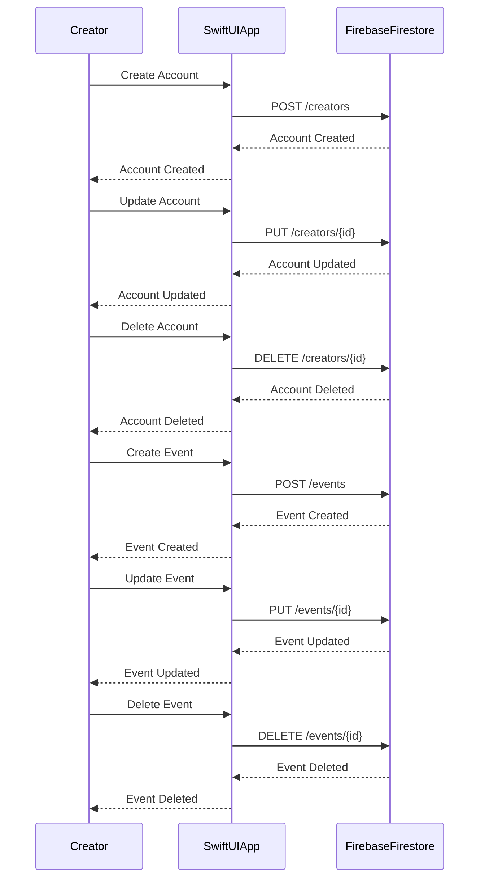
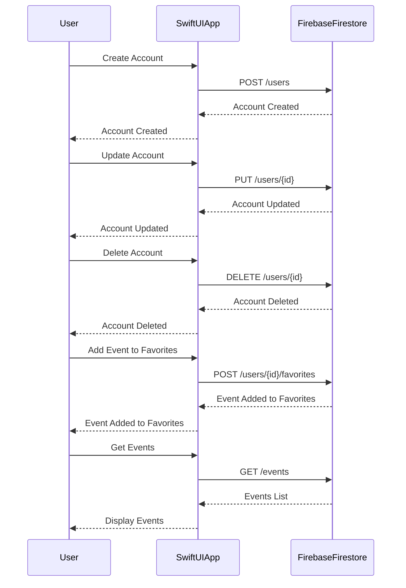

# IAKOA - Technical Documentation

## User Stories and Mockup

### Must Have
- As a normal user, I want to search and find events around me or in a specific city/village, so I can explore activities in my desired location
- As a normal user, I want the app to detect my location automatically, so I can see nearby events without manual input
- As a normal user, I want to filter events by category, so I can find relevant events easily
- As a normal user, I want to see a list of events near my current location, so I can browse them quickly
- As a normal user, I want to view detailed event information, so I can decide whether to attend
- As a user, I want to create an account, so I can save favorites and receive - notifications
- As a user, I want to add events to favorites, so I can access them easily later
- As a user, I want to receive notifications for favorite events, so I stay updated
- As a user, I want to manage my profile information and preferences, so I can - customize my experience
- As a user, I want an iPhone-optimized app, so I can have a seamless experience
- As a user, I want a simple, intuitive interface, so I can navigate easily
- As a user, I want to delete my account permanently, so I can remove all my personal data from the app
- As an event creator, I want to create, edit, and manage my events, so I can keep information accurate
- As a creator, I want SIREN/SIRET verification, so users trust my events
- As an event creator, I want to manage and delete my events, so I can keep my event list up-to-date and accurate
- As a developer, I want to use Firebase for backend management, so I can build efficiently
- As a QA tester, I want thorough testing, so the app is bug-free
- As a visitor, I want a landing page explaining app features, so I understand its purpose

### Should Have
- As a user, I want to search events by city name when not nearby, so I can plan ahead
- As a user, I want personalized notifications, so I receive relevant alerts
- As a user, I want dark/light mode, so I can view comfortably at any time
- As a user, I want to share events on social media, so I can invite friends

### Could Have
- As a creator, I want event performance analytics, so I can improve future events
- As a user, I want a calendar view of events, so I can plan more effectively
- As a user, I want to message event organizers, so I can ask questions or get more info
- As a user, I want to see trending events, so I don’t miss popular activities
- As a normal user, I want to see events on a map, so I can visualize their locations easily

### 4.Won’t Have
- Ticket purchasing will not be available in-app.
- As a user, I want event recommendations based on preferences, so I can discover relevant events.
- Social media login/integration will not be available.
- Multi-language support only.
- User reviews will not be available in this version.
- Advanced search filters will not be available.
- Event reminders will not be available.
- Personalized recommendations will not be available.
- Live streaming will not be available.

## First UI Design :

## Design System Architecture

## Components, Classes, and Database Design

---
## High-Level Sequence Diagrams

### Creator and User Sequence Diagram

---
### 👤 Detailed User Class

#### Attributes
| Name           | Type      | Description                            | Constraints                                    |
| -------------- | --------- | -------------------------------------- | ---------------------------------------------- |
| id             | String    | Unique identifier of the user          | Required, Unique                               |
| email          | String    | User's email address                   | Required, Unique, Must be a valid email format |
| password       | String    | User's password                        | Required, Must be encrypted                    |
| favoritesEvent | \[String] | List of favorite event identifiers     | Can be empty                                   |
| createAt       | Date      | Date the user account was created      | Required, Automatically generated              |
| updateAt       | Date      | Date the user account was last updated | Required, Automatically generated              |

#### Methods
| Name                | Parameters                                                    | Description                                        | Return Type |
| ------------------- | ------------------------------------------------------------- | -------------------------------------------------- | ----------- |
| createUser          | nickname: String, email: String, password: String             | Creates a new user                                 | Void        |
| updateUser          | id: String, nickname: String, email: String, password: String | Updates an existing user's information             | Void        |
| deleteUser          | id: String                                                    | Deletes a user                                     | Void        |
| addFavoriteEvent    | userId: String, eventId: String                               | Adds an event to the user's list of favorites      | Void        |
| removeFavoriteEvent | userId: String, eventId: String                               | Removes an event from the user's list of favorites | Void        |

#### Relations
| Related Class | Relationship Type  | Description                                                              |
| ------------- | ------------------ | ------------------------------------------------------------------------ |
| Event         | Association (1\:N) | A user can search for and add multiple events to their list of favorites |

---

### ✍️ Detailed Creator Class

#### Attributes

| Attribute   | Type   | Description                      | Constraints                          |
|-------------|--------|----------------------------------|--------------------------------------|
| id          | String | Unique identifier of the creator | Required, Unique                     |
| name        | String | Name of the creator              | Required                             |
| email       | String | Email address of the creator     | Required, Unique, Valid email format |
| password    | String | Creator's password               | Required, Encrypted                  |
| siren       | String | SIREN number                     | Required, Valid format               |
| createAt    | Date   | Account creation date            | Required, Auto-generated             |
| updateAt    | Date   | Last update date                 | Required, Auto-generated             |

#### Methods
| Method         | Parameters                                                                                          | Description              | Return Type |
|----------------|-----------------------------------------------------------------------------------------------------|--------------------------|-------------|
| createCreator  | name: String, email: String, password: String, siren: String, siret: String                      | Creates a new creator       | Void        |
| updateCreator  | id: String, name: String, email: String, password: String, siren: String, siret: String          | Updates an existing creator | Void     |
| deleteCreator  | id: String                                                                                        | Deletes a creator           | Void        |

#### Relationships
| Related Class | Relationship Type | Description                                      |
|----------------|-------------------|--------------------------------------------------|
| Creator        | One-to-Many       | A creator can create and own multiple events     |

---

### 📅 Detailed Event Class

#### Attributes
| Name           | Type      | Description                            | Constraints                                    |
| ------------ | -------- | ----------------------------------------------- | ---------------------------------------------- |
| id           | String   | Unique identifier for the event                 | Required, Unique                              |
| creatorId    | String   | Identifier of the event creator                | Required                                       |
| name         | String   | Name of the event                              | Required                                       |
| description  | String   | Description of the event                       | Can be empty                                   |
| location     | String   | Location of the event                          | Required                                       |
| pricing      | Int      | Price of the event (0 if free)                 | Required                                       |
| date         | Date     | Date of the event                              | Required                                       |
| facebookLink | String?  | Link to the Facebook page of the event          | Optional                                       |
| instagramLink| String?  | Link to the Instagram page of the event        | Optional                                       |
| tiktokLink   | String?  | Link to the TikTok page of the event           | Optional                                       |
| youtubeLink  | String?  | Link to the YouTube page of the event          | Optional                                       |
| xLink        | String?  | Link to the X (Twitter) page of the event      | Optional                                       |
| websiteLink  | String?  | Link to the website of the event               | Optional                                       |
| createAt     | Date     | Date of creation of the event                   | Required, Auto-generated                       |
| updateAt     | Date     | Date of the last update of the event           | Can be empty, Auto-generated                        |

#### Methods
| Method         | Parameters                                                                                          | Description              | Return Type |
|----------------|-----------------------------------------------------------------------------------------------------|--------------------------|-------------|
| createEvent  | id: String, creatorId: String, name: String, description: String, location: String, pricing: Int, date: Date, facebookLink: String?, instagramLink: String?, tiktokLink: String?, youtubeLink: String?, xLink: String?, websiteLink: String?                   | Creates a new event   | Void        |
| updateEvent  | id: String, creatorId: String, name: String, description: String, location: String, pricing: Int, date: Date, facebookLink: String?, instagramLink: String?, tiktokLink: String?, youtubeLink: String?, xLink: String?, websiteLink: String?           | Updates an existing creator | Void     |
| deleteEvent  | id: String, creatorId: String                                                                                        | Deletes a creator and events associated      | Void        |

#### Relations
| Related Class  | Relationship Type | Description                                 |
|----------------|-------------------|---------------------------------------------|
| Creator          | One-to-Many       | An event can be own only by one creator   |

---

## Firebase SDK
**As I’m building my app with SwiftUI and Firebase, I’ve chosen to use the Firebase SDK directly. Below is a comparison between the REST API endpoints and the corresponding Firebase SDK methods I’ll be using in the project.**
### 👤 USERS

| Action              | REST API Endpoint                           | Firebase SDK (Swift)                                                                 |
|---------------------|---------------------------------------------|---------------------------------------------------------------------------------------|
| Create user         | POST `/api/users`                           | `Auth.auth().createUser(...)` + `Firestore().collection("users").addDocument(...)`   |
| Get user by ID      | GET `/api/users/{id}`                       | `Firestore().collection("users").document(id).getDocument(...)`                      |
| Update user         | PUT `/api/users/{id}`                       | `Firestore().collection("users").document(id).updateData(...)`                       |
| Delete user         | DELETE `/api/users/{id}`                    | `Firestore().collection("users").document(id).delete(...)`                           |
| Get favorites       | GET `/api/users/{id}/favorites`             | `Firestore().collection("users").document(id).collection("favorites").getDocuments(...)` |
| Add favorite        | POST `/api/users/{id}/favorites`            | `Firestore().collection("users").document(id).collection("favorites").document(eventId).setData(...)` |
| Remove favorite     | DELETE `/api/users/{id}/favorites/{eventId}`| `Firestore().collection("users").document(id).collection("favorites").document(eventId).delete(...)` |

### 🧑‍🎨 CREATORS

| Action         | REST API Endpoint           | Firebase SDK (Swift)                                               |
| -------------- | --------------------------- | ------------------------------------------------------------------ |
| Create creator | POST `/api/creators`        | `Firestore().collection("creators").addDocument(...)`              |
| Get creator    | GET `/api/creators/{id}`    | `Firestore().collection("creators").document(id).getDocument(...)` |
| Update creator | PUT `/api/creators/{id}`    | `Firestore().collection("creators").document(id).updateData(...)`  |
| Delete creator | DELETE `/api/creators/{id}` | `Firestore().collection("creators").document(id).delete(...)`      |
|                |                             |                                                                    |

### 🎉 EVENTS

| Action          | REST API Endpoint         | Firebase SDK (Swift)                                                 |
| --------------- | ------------------------- | -------------------------------------------------------------------- |
| Create event    | POST `/api/events`        | `Firestore().collection("events").addDocument(...)`                  |
| Get event by ID | GET `/api/events/{id}`    | `Firestore().collection("events").document(id).getDocument(...)`     |
| Update event    | PUT `/api/events/{id}`    | `Firestore().collection("events").document(id).updateData(...)`      |
| Delete event    | DELETE `/api/events/{id}` | `Firestore().collection("events").document(id).delete(...)`          |
| Search events   | GET `/api/events/search`  | `Firestore().collection("events").whereField(...).getDocuments(...)` |

---
### List of external APIs:
- **CoreLocation:** Apple framework for obtaining the geographical position of the device
- **MapKit:** Apple framework for displaying and interacting with maps
- **Sirene:** Unique identification number for businesses in France (SIREN)
- **Image/PDF Analysis API**: API for analyzing and extracting information from images and PDFs (ex: Google Cloud Vision / PDF.co)

--- 
## Plan Software Configuration Management and Quality Assurance Strategies

### SCM Strategy
1. Version Control Tool:
  - **Tool**: Git
  - **Purpose**: To manage code versions, track changes, and facilitate collaboration among developers.

2. Branching Strategies:
  - **main** — for the functional project (stable, production-ready)
  - **dev** — for improvements (integration and development of new features)
  - **test** — for testing (quality assurance, validation)

3. Commit and Code Review Process:
- **Regular Commits:** commit changes regularly with meaningful commit messages

### QA Strategy
### 1. Testing Strategy:

  - **Unit Tests:** Write unit tests for individual functions and methods to ensure they work as expected
  - **Integration Tests:** 
    - Verify the interaction between your SwiftUI views and Firebase services (authentication, database reads/writes).
    - Use tools like XCTest with mock Firebase services or use Firebase emulators to simulate backend responses.
  - **Manual Testing:** Perform manual testing for critical user flows and edge cases
### 2. Testing Tools:
  - Unit Tests: XCTest (for SwiftUI)
  - Manual Testing
